= Domain Registration and Hosted Zone Setup in AWS Route 53

== Prerequisites
- An AWS account with necessary permissions to manage Route 53.
- A registered domain name or a new domain to be registered.

== Step 1: Register a New Domain in Route 53
1. Open the **AWS Management Console** and navigate to **Route 53**.
+
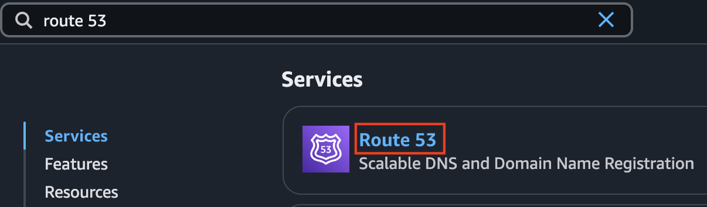
2. In the left navigation pane, click on **Registered Domains**.
+
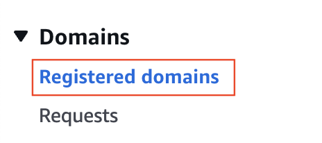
3. Click **Register Domain**.
+
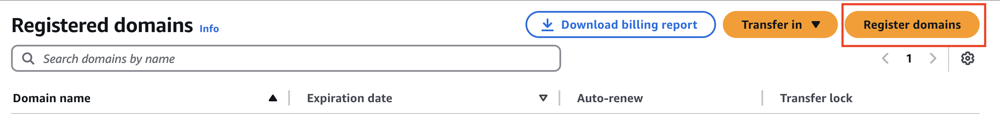
4. Enter the domain name you wish to register and select a top-level domain (TLD).
5. Click **Check** to verify availability.
+
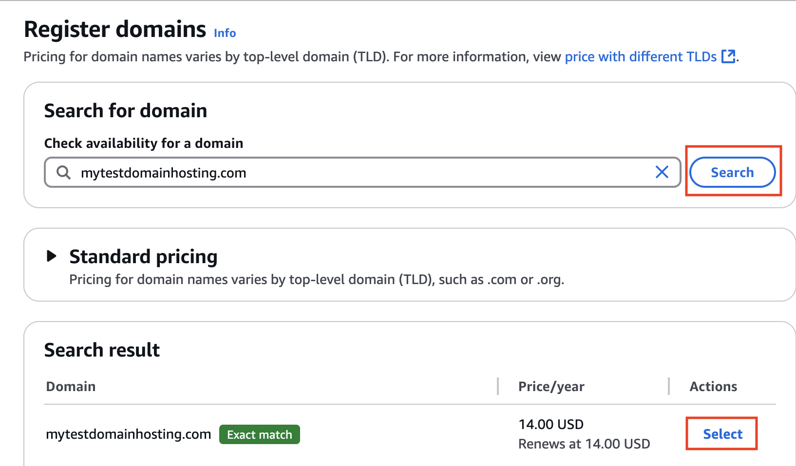
6. If available, select the domain and click **Add to cart**.
+
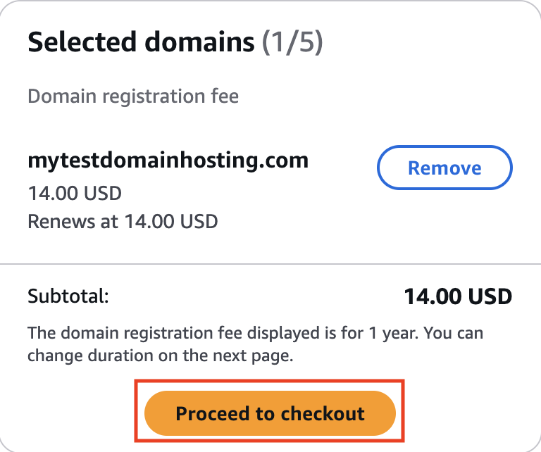
7. Complete the registration details:
   - Enter contact information.
   - Select whether to enable **privacy protection**.
8. Review the details and click **Purchase and Register**.
+
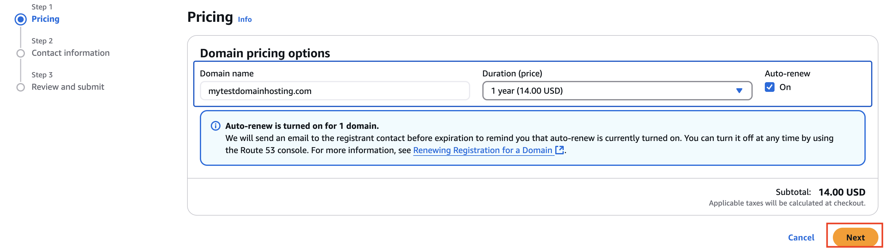
9. Wait for the domain registration to complete (can take a few minutes to hours).

== Step 2: Create a Hosted Zone in Route 53
1. In the Route 53 console, navigate to **Hosted Zones**.
+
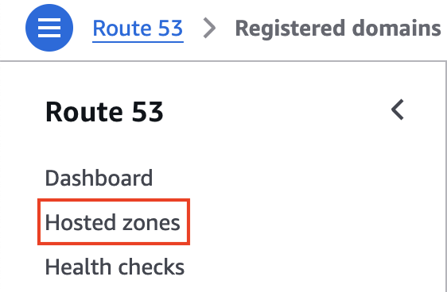
2. Click **Create Hosted Zone**.
+
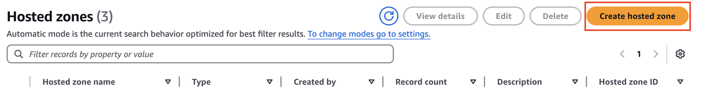
3. Enter your domain name in the **Domain Name** field.
4. Set the **Type** to **Public Hosted Zone**.
+
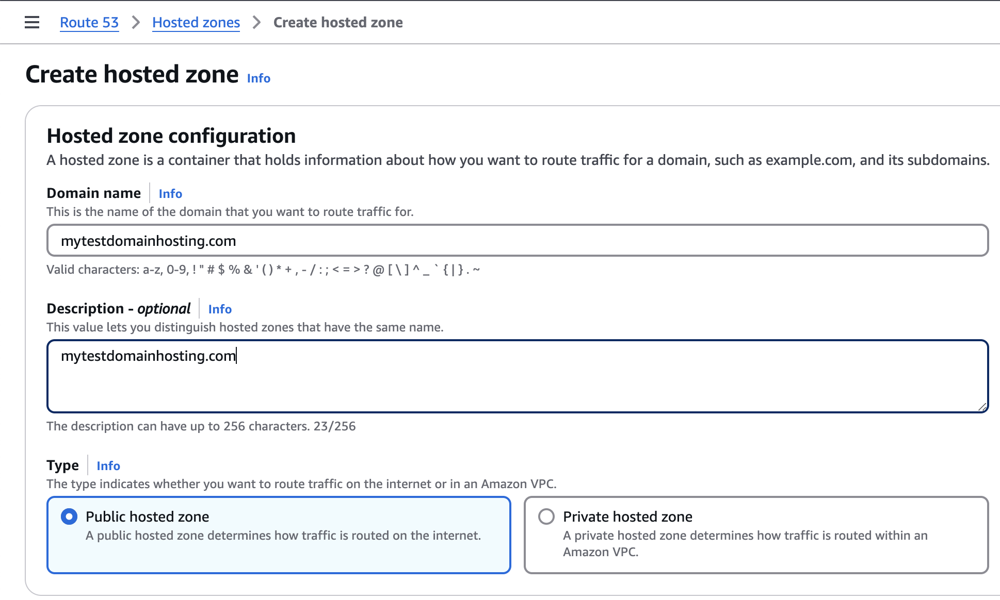
5. Click **Create Hosted Zone**.
6. Note the NS (Name Server) records displayed in the hosted zone.

== Step 3: Verify NS Record Alignment
1. Navigate to **Route 53 > Registered Domains**.
2. Click on your domain name to access domain settings.
3. Locate the **Name Servers** section.
4. Compare the NS records listed with those in the **Hosted Zone**.
+
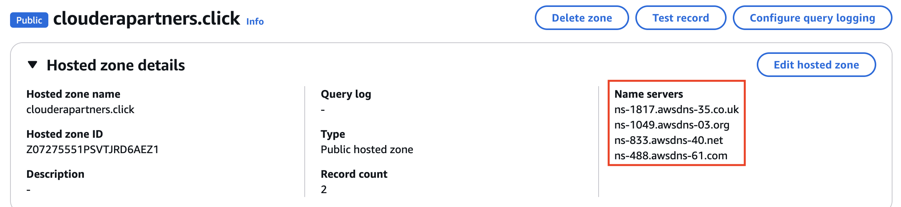
5. If they do not match:
   - Click **Edit** in the domain's NS records section.
   - Update the Name Servers to match the ones in the Hosted Zone.
   - Click **Save**.
6. Propagation of DNS changes can take up to 48 hours.

== Step 4: Verify Record Creation in Route 53
1. Navigate to **Hosted Zones** and select your domain.
2. Ensure the following records exist:
   - **NS (Name Server) records** – Matches the domain's NS records.
   - **SOA (Start of Authority) record** – Default record created.
+
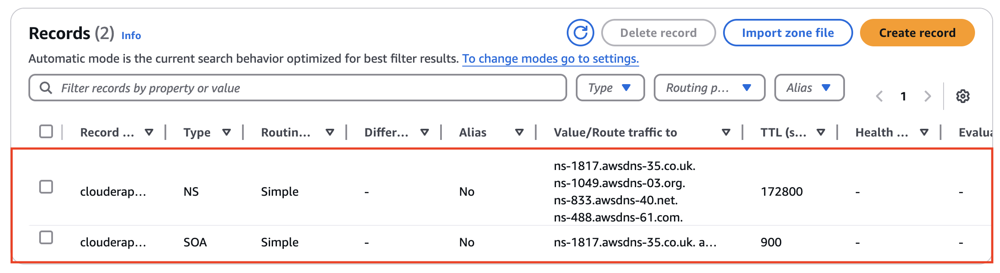
3. If additional records are needed (e.g., A, CNAME, TXT, MX):
   - Click **Create Record**.
   - Select the record type and enter required values.
   - Click **Create Record**.
4. To test the records:
   - Use `nslookup <domain-name>` or `dig <domain-name>` in the terminal.
   - Check DNS resolution and propagation.

== Required IAM Policies for Managing Route 53 Hosted Zones
To allow a user to manage Route 53 hosted zones, attach the following policies to their IAM role:

=== AWS Managed Policies
- **AmazonRoute53FullAccess**: Grants full access to Route 53 resources.
- **AmazonRoute53ReadOnlyAccess**: Provides read-only access to Route 53.

=== Custom IAM Policy for Hosted Zone Management
If you need a more restrictive policy, use the following JSON policy:

[source,json]
----
{
    "Version": "2012-10-17",
    "Statement": [
        {
            "Effect": "Allow",
            "Action": [
                "route53:ListHostedZones",
                "route53:GetHostedZone",
                "route53:CreateHostedZone",
                "route53:DeleteHostedZone",
                "route53:ChangeResourceRecordSets",
                "route53:ListResourceRecordSets"
            ],
            "Resource": "*"
        }
    ]
}
----

== Creating a Short-Lived TXT Record for Testing
To create a temporary TXT record in Route 53 for testing purposes, use the following AWS CLI command:

[source,bash]
----
aws route53 change-resource-record-sets --hosted-zone-id <HOSTED_ZONE_ID> --change-batch '{
    "Changes": [
        {
            "Action": "UPSERT",
            "ResourceRecordSet": {
                "Name": "_test.<DOMAIN_NAME>",
                "Type": "TXT",
                "TTL": 60,
                "ResourceRecords": [
                    { "Value": "\"temporary-test-value\"" }
                ]
            }
        }
    ]
}'
----

Replace `<HOSTED_ZONE_ID>` with your hosted zone ID and `<DOMAIN_NAME>` with your domain name.

== Conclusion
Following these steps ensures your domain is properly registered, linked with a hosted zone, and verified with correct NS records in AWS Route 53.

