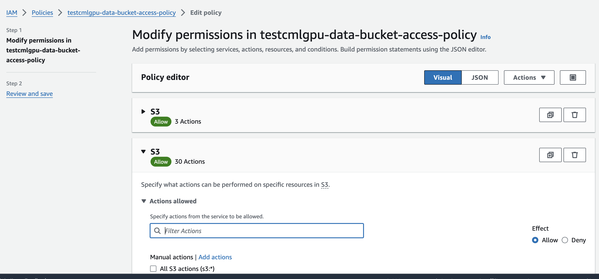

= CML Workshop Instructor Guide
:toc:

= Prerequisites

Before executing workshop steps, first Create Ranger Policy for RAZ-Enabled AWS Environment on CDP and update **data-bucket-access-policy** on AWS. Then declare **HIVE_DATABASE**, **DATA_LOCATION**, **HIVE_TABLE** Environment variables on CML workshop console.

== Creating Ranger Policy for RAZ-Enabled AWS Environment

After you register the RAZ-enabled AWS environment, you can log in to Ranger to create policies for granular access to the environment's cloud storage location. To create the Ranger policy, you must first create the required S3 policy and then a Hive URL authorization policy on an S3 path for the end user.

=== Creating the Required S3 Policy

To create the required S3 policy on an S3 path for an end user, perform the following steps:

. Navigate to the Ranger UI.
. On the `S3` tab, click `cm_s3`.
. Click `Add New Policy` in the top right corner.
. Provide the following policy details:
  .. Enter _Policy Name_.
  .. Enter an _S3 Bucket_ name.
  .. Provide a _Path_ within the S3 bucket.
  .. Select _Groups_ and _Permissions_ to assign to the end user.
+
**Only Read and Write permissions can be assigned to the end user.**
+
image::../Guide/cml-media/media/RangerS3.png[alt="Sample Create Policy Page in Ranger UI"]

. Click `Add` to save the policy.

=== Creating the Hive URL Authorization Policy

To create a Hive URL authorization policy on an S3 path for the end user, perform the following steps:

. Navigate to the Ranger UI.
. On the `Hadoop SQL` tab, click `Hadoop SQL`.
. Click `Add New Policy` in the top right corner.
. Provide the policy details:
  .. Enter _Policy Name_.
  .. Enter the _Hive URL authorization path_ in the URL field, and enable the `Recursive` option.
+
**Note:** You can append `\*`, also known as a "wildcard," to the path name. For example: `s3a://bucket/*`. Appending `*` to a URL path grants (or denies) access to the child directories in that path.
+
**Assign all permissions to the end user.**
+
image::../Guide/cml-media/media/RangerS3_2.png[alt="Sample Policy Details Page in Ranger UI"]

. Click `Add` to save the policy.

== Updating **data-bucket-access-policy** on AWS

. Sign in to AWS Console and navigate to IAM under Security, Identity, & Compliance.
. Click Policies, search for the policy `<workshop-name>-data-bucket-access-policy`, and select it.
. Click Edit policy, then choose Visual editor.
. Under Service, select S3.
. Under Actions, check PutObject and DeleteObject.
. Click Next and Save the changes.

image::../Guide/cml-media/media/Policy2.png[alt="Sample Policy Details Page in AWS Console"]
image::../Guide/cml-media/media/Policy3.png[alt="Sample Policy Details Page in AWS Console"]

== Declare Environment variables from CML workshop UI

Login into CDP using the URL above and the credentials assigned to you. After logging into CDP you will have access to the main console and then click on Machine Learning tile. Click on Workspace to proceed to executing the hands-on labs.

++++

  

++++

This will launch a ML workspace screen.

++++

  

++++

Inside the workshop console, scroll down the left section of the screen to the bottom. Click on **Site Administration** and then **Runtime**.

++++

  

++++

Scroll down the Runtime page to the bottom and add the highlighted **Names** and **Values** under Environment Variables.

++++

  

++++

Again scroll to the top and click on Update Runtimes now to save changes.
++++

  

++++
